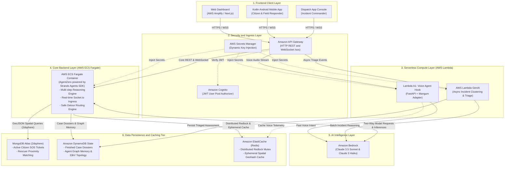
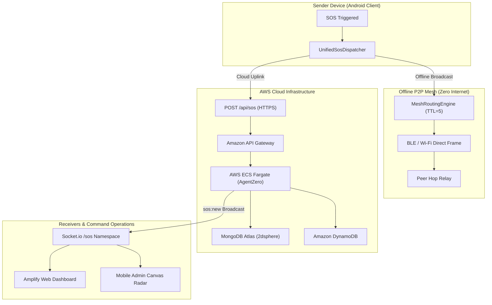
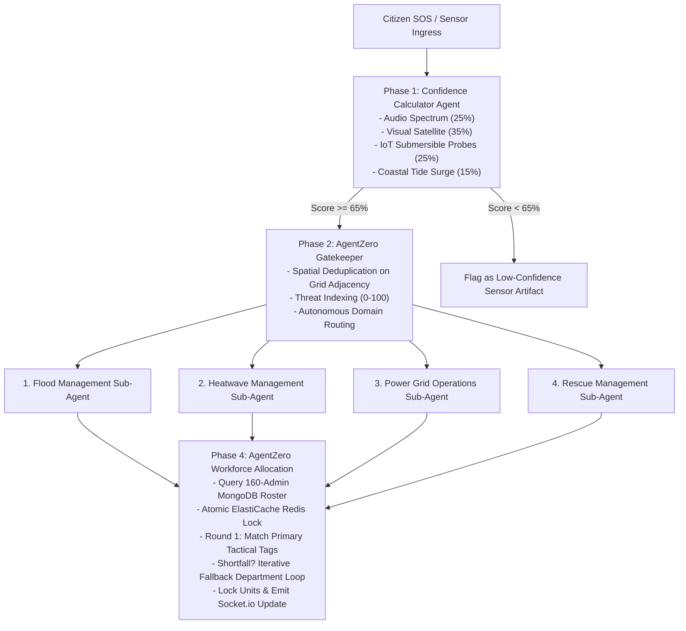
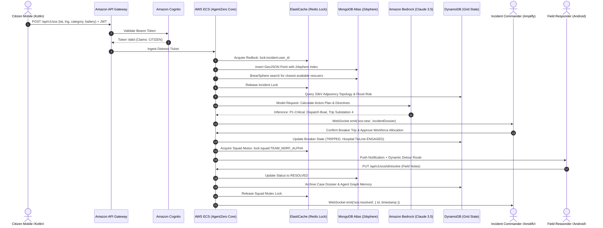

# ZeroGrid — Autonomous Emergency Response & Off-Grid Mesh Platform

> **Zero-Infrastructure Disaster Coordination, P2P Mesh Networking & Circular Multi-Agent Crisis Engine Native to AWS**  
> Bridges peer-to-peer off-grid alerting across Android devices (BLE / Wi-Fi Direct / 868MHz) with an autonomous 4-phase multi-agent crisis command center (AgentZero powered by the **Strands Agents SDK** + 160-Admin Workforce) and cloud operations running natively on **Amazon Web Services (AWS)**.

---

## 🏗️ System Architecture (Official AWS Cloud Infrastructure)


---

## 📑 Table of Contents

1. [Executive Ecosystem Overview](#1-executive-ecosystem-overview)
2. [AWS Cloud-Native 6-Tier Microservices Architecture](#2-aws-cloud-native-6-tier-microservices-architecture)
3. [Dual-Transport Protocol & Packet Architecture](#3-dual-transport-protocol--packet-architecture)
   - 3.1 [End-to-End Packet Lifecycle](#31-end-to-end-packet-lifecycle)
   - 3.2 [32-Bit Word-Aligned P2P RF Mesh Frame Layout](#32-32-bit-word-aligned-p2p-rf-mesh-frame-layout)
   - 3.3 [Binary Header Specification](#33-binary-header-specification)
   - 3.4 [Online REST & WebSocket Ingress Envelope](#34-online-rest--websocket-ingress-envelope)
   - 3.5 [TTL Hop Control & 500-Slot LRU Deduplication](#35-ttl-hop-control--500-slot-lru-deduplication)
4. [Autonomous 4-Phase Circular Multi-Agent Pipeline](#4-autonomous-4-phase-circular-multi-agent-pipeline)
   - 4.1 [Confidence Calculator & Gatekeeper Flow](#41-confidence-calculator--gatekeeper-flow)
   - 4.2 [Specialized Crisis Sub-Agents](#42-specialized-crisis-sub-agents)
   - 4.3 [160-Admin Workforce Allocation & Collision Defense](#43-160-admin-workforce-allocation--collision-defense)
   - 4.4 [Electrical Grid Solver & HITL Circuit Breaker Safety](#44-electrical-grid-solver--hitl-circuit-breaker-safety)
5. [End-to-End Emergency Incident Lifecycle](#5-end-to-end-emergency-incident-lifecycle)
6. [Mobile Application Working Core (`app/`)](#6-mobile-application-working-core-app)
   - 6.1 [Dual-Path SOS Dispatch Orchestration](#61-dual-path-sos-dispatch-orchestration)
   - 6.2 [Safe Route Copilot & Dynamic Flood Hazard Radar](#62-safe-route-copilot--dynamic-flood-hazard-radar)
   - 6.3 [Tactical Compass Radar vs. Google Maps Mode](#63-tactical-compass-radar-vs-google-maps-mode)
   - 6.4 [Background Resilience & WorkManager Offline Sync](#64-background-resilience--workmanager-offline-sync)
7. [Monorepo & Codebase Directory Structure](#7-monorepo--codebase-directory-structure)
8. [AWS Cloud Infrastructure & Service Matrix](#8-aws-cloud-infrastructure--service-matrix)
9. [Local Development, Deployment & Quickstart](#9-local-development-deployment--quickstart)
10. [Security, Governance & Resilience Model](#10-security-governance--resilience-model)

---

## 1. Executive Ecosystem Overview

ZeroGrid provides continuous, resilient disaster coordination across extreme disaster conditions: total power grid collapse, drowned telecommunications towers, and severe infrastructure disruptions. 

```
┌────────────────────────────────────────────────────────────────────────────────────────┐
│                              LOCAL DISASTER AREA (OFF-GRID)                            │
│                                                                                        │
│   [Citizen A (Sender)] ───(BLE GATT / Wi-Fi P2P)───► [Citizen B (Relay Node)]          │
│            │                                                    │                      │
│      (No Cellular)                                        (BLE / Wi-Fi P2P)            │
│            │                                                    ▼                      │
│            └────────────────────────────────────────► [Citizen C (Opportunistic Mule)] │
└─────────────────────────────────────────────────────────────────┬──────────────────────┘
                                                                  │ (Cellular / Starlink / Wi-Fi)
                                                                  ▼
┌────────────────────────────────────────────────────────────────────────────────────────┐
│                              AWS CLOUD BACKEND PLATFORM                                │
│                                                                                        │
│   ┌───────────────────────────┐        ┌───────────────────────────────────────────┐   │
│   │ Amazon Cognito User Pools │◄───────┤     AWS API Gateway / CloudFront CDN      │   │
│   │ (JWT Signature Validate)  │        │ (HTTPS REST & WebSocket /sos Ingress)     │   │
│   └───────────────────────────┘        └─────────────────────┬─────────────────────┘   │
│                                                              │                         │
│                  ┌───────────────────────────────────────────┴───────────────┐         │
│                  ▼ (Voice Audio Stream)                                      ▼         │
│   ┌─────────────────────────────────────────┐   ┌──────────────────────────────────┐   │
│   │ [Lambda A1] Voice Agent Hook            │   │ AWS ECS Fargate Container        │   │
│   │ (FastAPI + Mangum -> Bedrock Haiku)     │   │ (AgentZero via Strands SDK)      │   │
│   └─────────────────────────────────────────┘   └──────────────────┬───────────────┘   │
│                                                                    │                   │
│                                           ┌────────────────────────┴────────┐          │
│                                           ▼                                 ▼          │
│                            ┌─────────────────────────────┐   ┌─────────────────────┐   │
│                            │ MongoDB Atlas (2dsphere)    │   │ ElastiCache Redis   │   │
│                            │ (Active Incidents & Rescuer)│   │ (Redlock & Cache)   │   │
│                            └─────────────────────────────┘   └─────────────────────┘   │
└────────────────────────────────────────────────────────────────────────────────────────┘
```

1. **Local Off-Grid Mesh Tier**: Autonomous ad-hoc peer-to-peer networks over BLE 5.0 and Wi-Fi Direct. Packets hop across peer smartphones without cellular towers or fixed routers.
2. **Opportunistic Cloud Ingress**: As soon as any mesh node gains cellular, satellite, or Wi-Fi uplink, it acts as a data mule, forwarding queued distress packets into AWS.
3. **Autonomous Command & Control Tier**: Incident dispatches are ingested by **AgentZero** (powered by the **Strands Agents SDK** on AWS ECS Fargate), classified by multi-modal AI in **Amazon Bedrock**, synchronized across **MongoDB Atlas (2dsphere)**, locked via **Amazon ElastiCache Redis**, and surfaced live to dispatchers on **AWS Amplify**.

---

## 2. AWS Cloud-Native 6-Tier Microservices Architecture



---

## 3. Dual-Transport Protocol & Packet Architecture

ZeroGrid operates on a **Dual-Transport Protocol**: every emergency alert fans out simultaneously across an **Offline P2P RF Mesh Frame** and an **Online REST/WebSocket Packet**.

### 3.1 End-to-End Packet Lifecycle



---

### 3.2 32-Bit Word-Aligned P2P RF Mesh Frame Layout

For transmission over Bluetooth Low Energy (BLE GATT) and Wi-Fi Direct under extreme bandwidth constraints, ZeroGrid packs emergency payloads into a deterministic 32-bit aligned binary frame:


---

### 3.3 Binary Header Specification

| Byte Offset | Field Name | Data Type | Size | Description / Constraints |
| :--- | :--- | :--- | :--- | :--- |
| **0x00** | `MAGIC_BYTE` | `uint8` | 1 Byte | Frame identifier: `0x5A` (ASCII `'Z'`). |
| **0x01** | `PACKET_TYPE` | `uint8` | 1 Byte | `0x01` SOS, `0x02` MSG, `0x03` ANNOUNCE, `0x04` ACK. |
| **0x02** | `TTL` | `uint8` | 1 Byte | Time-to-Live hop counter (Default: `5`, max: `10`). Decremented per hop. |
| **0x03** | `BATTERY_PCT` | `uint8` | 1 Byte | Sender device battery percentage (`0–100%`). |
| **0x04–0x07**| `SENDER_HASH` | `uint32` | 4 Bytes | CRC32 hash of originating device public key. |
| **0x08–0x0B**| `TARGET_ADDR` | `uint32` | 4 Bytes | `0xFFFFFFFF` for broadcast; specific node hash for unicast. |
| **0x0C–0x0F**| `LATITUDE` | `float32` | 4 Bytes | IEEE 754 single-precision GPS latitude coordinate. |
| **0x10–0x13**| `LONGITUDE` | `float32` | 4 Bytes | IEEE 754 single-precision GPS longitude coordinate. |
| **0x14–0x15**| `ACCURACY` | `float16` | 2 Bytes | GPS horizontal accuracy radius in meters. |
| **0x16** | `CATEGORY` | `uint8` | 1 Byte | `0x00` Medical, `0x01` Flood, `0x02` Trapped, `0x03` Fire. |
| **0x17** | `PAYLOAD_LEN` | `uint8` | 1 Byte | Byte length of trailing dynamic UTF-8 message string. |
| **0x18–0x19**| `FLAGS` | `uint16` | 2 Bytes | Bitmask flags: Bit 0 = Critical, Bit 1 = Breaker Risk. |
| **Dynamic** | `PAYLOAD` | `string` | Variable | UTF-8 encoded text message (e.g. *"Water at 2 meters"*). |
| **Tail** | `CRC32` | `uint32` | 4 Bytes | IEEE 802.3 CRC-32 integrity validation checksum. |

---

### 3.4 Online REST & WebSocket Ingress Envelope

When transmitting over cellular, Starlink, or Wi-Fi to AWS API Gateway, packets use a verified JSON structure:

```json
{
  "packetId": "d9b2e048-c89b-4b13-a7cf-e48f1082aa91",
  "senderId": "node-8f2a1b",
  "recipientId": "*",
  "ttl": 5,
  "hopCount": 0,
  "type": "SOS_BEACON",
  "payload": {
    "category": "MEDICAL",
    "message": "Trapped on terrace, water rising fast",
    "lat": 19.4564,
    "lng": 72.8258,
    "accuracy": 4.8,
    "battery": 78,
    "senderName": "Citizen-Alpha"
  },
  "timestamp": 1773321600000,
  "signature": "ed25519_sig_hex_stream..."
}
```

---

### 3.5 TTL Hop Control & 500-Slot LRU Deduplication

To prevent devastating infinite broadcast storms across peer mesh networks, each node processes incoming packets through a deterministic filter:

```
[Incoming Packet Ingress]
           │
           ▼
  DeduplicationCache.contains(packetId)?
     ├── YES ──► [DROP PACKET IMMEDIATELY] (Zero-cost loop defense)
     └── NO  ──► Commit packetId to 500-slot LRU Cache
                 │
                 ▼
  Is recipientId == localNodeId OR "*"?
     ├── YES ──► Parse payload & render on UI (SosCenter / Alert HUD)
     └── NO  ──► Skip local display
                 │
                 ▼
  Is TTL > 1?
     ├── NO  ──► [DROP PACKET] (Reached maximum hop horizon)
     └── YES ──► Clone packet:
                   ttl = ttl - 1
                   hopCount = hopCount + 1
                 Relay to all connected peers in PeerTable EXCLUDING sender
```

---

## 4. Autonomous 4-Phase Circular Multi-Agent Pipeline

To prevent emergency dispatch hallucination, false alarm panic, and command overload during mass disasters, all alerts are processed by a multi-agent validation pipeline:

$$\text{Confidence Calculator } (\ge 65\%) \longrightarrow \text{Agent 0 Gatekeeper} \longrightarrow \text{4 Specialized Sub-Agents} \longrightarrow \text{Agent 0 Workforce Allocation}$$



---

### 4.1 Confidence Calculator & Gatekeeper Flow

Incoming signals are evaluated against a multi-modal weighted scoring matrix before reaching human operators:

$$\text{Confidence Score} = (0.25 \times \text{Audio}) + (0.35 \times \text{Visual}) + (0.25 \times \text{IoT Depth}) + (0.15 \times \text{Tide Surge})$$

* Alerts scoring **$\ge 65\%$** are certified as high-confidence emergencies and routed instantly.
* Alerts scoring **$< 65\%$** are held in an in-memory observation queue to prevent false panic.

---

### 4.2 Specialized Crisis Sub-Agents

1. **Flood Management Sub-Agent**: Calculates hydrodynamics, evaluates road submergence, and requests equipment tags (`DEWATERING`, `ZODIAC_BOAT`).
2. **Heatwave Management Sub-Agent**: Monitors wet-bulb temperatures, flags hydration deficit zones, and requests `MEDICAL_TRIAGE` squads.
3. **Power Grid Operations Sub-Agent**: Traverses the **Amazon DynamoDB** electrical topology, cross-references water levels with transformer elevations, and calculates air-gap electrical isolations.
4. **Rescue Management Sub-Agent**: Coordinates heavy structural extraction, collapsed building search, and trauma paramedic deployment.

---

### 4.3 160-Admin Workforce Allocation & Collision Defense

The platform manages an active roster of **160 Admin accounts** in MongoDB, partitioned into four crisis departments (40 personnel each):

| Department Tag | Headcount | Primary Tactical Tags | Iterative Fallback Department |
| :--- | :--- | :--- | :--- |
| `FLOOD_MANAGEMENT` | 40 Admins | `DEWATERING`, `DEEP_WATER_RESQ`, `ZODIAC_BOAT` | `RESCUE_MANAGEMENT` |
| `HEATWAVE_MANAGEMENT` | 40 Admins | `MEDICAL_TRIAGE`, `HYDRATION_SQUAD`, `COOLING_STATION`| `RESCUE_MANAGEMENT` |
| `POWER_GRID_MANAGEMENT` | 40 Admins | `HV_LINEMAN`, `SUBSTATION_CREW`, `AIR_GAP_ISOLATION` | `RESCUE_MANAGEMENT` |
| `RESCUE_MANAGEMENT` | 40 Admins | `HEAVY_RESCUE`, `COLLAPSE_SEARCH`, `TRAUMA_PARAMEDIC` | `FLOOD_MANAGEMENT` |

* **Collision Defense**: Every squad allocation invokes an **Amazon ElastiCache Redis** atomic distributed lock (`SETNX lock:squad:TEAM_ALPHA px 300000`). If a squad is already deployed, AgentZero executes an **iterative fallback negotiation**, pulling equivalent personnel from the fallback department.

---

### 4.4 Electrical Grid Solver & HITL Circuit Breaker Safety

* **Hospital Lifeline ICU Protection**: Guarantees Sanjeevani Hospital ICU busbars are dynamically transferred to standby 33kV tie-lines before isolation of flooded primary substations.
* **Human-in-the-Loop (HITL) Safety Gate**: High-voltage breaker actuations require explicit digital sign-off from the Incident Commander via modal authentication before triggering lock-out/tag-out directives.

---

## 5. End-to-End Emergency Incident Lifecycle



---

## 6. Mobile Application Working Core (`app/`)

> 📘 **Deep-Dive Developer Guide**: Full implementation details are documented in [mobile application working core.md](file:///c:/Users/ACER/AndroidStudioProjects/gridzero/mobile%20application%20working%20core.md).

Built entirely in **Kotlin** and **Jetpack Compose (Material 3)** for Android 8.0+ (API 26 to 35).

---

### 6.1 Dual-Path SOS Dispatch Orchestration

[UnifiedSosDispatcher.kt](file:///c:/Users/ACER/AndroidStudioProjects/gridzero/app/src/main/java/com/example/zerogrid/emergency/UnifiedSosDispatcher.kt) executes a parallel dispatch strategy:
1. **Path A (Offline Mesh)**: Instantly encapsulates data into a binary frame and broadcasts across BLE GATT advertisements and Wi-Fi Direct sockets.
2. **Path B (Cloud Uplink)**: Verifies internet availability. If online, executes immediate HTTPS POST via Retrofit to Amazon API Gateway. If offline, schedules [SosUploadWorker.kt](file:///c:/Users/ACER/AndroidStudioProjects/gridzero/app/src/main/java/com/example/zerogrid/emergency/SosUploadWorker.kt) via WorkManager with exponential backoff.

---

### 6.2 Safe Route Copilot & Dynamic Flood Hazard Radar

* [SafeRouteCopilotScreen.kt](file:///c:/Users/ACER/AndroidStudioProjects/gridzero/app/src/main/java/com/example/zerogrid/emergency/SafeRouteCopilotScreen.kt): Turn-by-turn evacuation navigation HUD.
* [RouteSafetyAgent.kt](file:///c:/Users/ACER/AndroidStudioProjects/gridzero/app/src/main/java/com/example/zerogrid/emergency/RouteSafetyAgent.kt): Continuously measures user GPS coordinates against active flood polygons and downed power lines.
* [HazardOverlayView.kt](file:///c:/Users/ACER/AndroidStudioProjects/gridzero/app/src/main/java/com/example/zerogrid/emergency/HazardOverlayView.kt): Renders dynamic warning zones over the live map canvas.

---

### 6.3 Tactical Compass Radar vs. Google Maps Mode

Dispatchers toggle between:
1. **Google Maps View**: Satellite/road map with color-coded incident markers and accuracy circles.
2. **Tactical Radar Canvas (`TacticalRadarCanvas.kt`)**: Zero-dependency concentric `Canvas` screen oriented in real-time by the device's physical magnetometer compass, rendering relative bearings to nearby victims without network data.

---

### 6.4 Background Resilience & WorkManager Offline Sync

* **`MeshForegroundService.kt`**: Persistent foreground service keeping BLE advertising and central scanning active during sleep mode.
* **`SosUploadWorker.kt`**: WorkManager job with `BackoffPolicy.EXPONENTIAL` that uploads pending distress tickets the moment network connectivity returns.
* **`ZeroGridFcmService.kt`**: Delivers high-priority heads-up notifications for emergency warnings.

---

## 7. Monorepo & Codebase Directory Structure

```
gridzero/ (Repository Workspace Root)
│
├── gridZeroExpress/ (webapplication core)  # Web Application Core & Cloud Backend
│   │
│   ├── backend/                            # Express 5 + Node.js 20 Backend on AWS ECS Fargate
│   │   │                                   # (AgentZero powered by Strands Agents SDK, MongoDB 2dsphere, Redis)
│   │   ├── src/controllers/                # SOS, Detour Routes, Workforce, Hydrodynamics
│   │   ├── src/models/                     # User (160 Admins), SosEvent (2dsphere GeoJSON), ParentChildLink
│   │   ├── src/routes/                     # REST routes (/api/sos, /api/routes/detour, /api/admin)
│   │   ├── src/utils/                      # AgentZero Webhook, Tide/Weather, Grid Topology, Metrics
│   │   ├── .platform/                      # Nginx reverse proxy & WebSocket configuration for AWS
│   │   └── package.json                    # Backend dependencies
│   │
│   ├── frontend/                           # Operations & Dispatch Command Center on AWS Amplify
│   │   ├── public/maplibre-gl-worker.mjs   # Static MapLibre Web Worker
│   │   ├── src/app/(app)/dashboard/        # Agent Zero Command Center (Telemetry Graphs & KPIs)
│   │   ├── src/app/(app)/admin/            # Master Incident Map & Operations Console
│   │   ├── src/components/admin/           # SosLiveMap (Amazon Location Service v2 / MapLibre)
│   │   ├── src/components/voice/           # Tactical Voice-AI Assistant
│   │   ├── src/lib/voiceAgent.ts           # Autonomous Orchestration & Fallback Engine
│   │   └── package.json                    # Frontend dependencies
│   │
│   ├── voice-agent/                        # [Lambda A1] Serverless Voice-AI Microservice on AWS Lambda
│   │   ├── main.py                         # FastAPI + Mangum Serverless Adapter (Bedrock Haiku)
│   │   ├── grid_graph.py                   # Single-Table DynamoDB Adjacency Graph Engine
│   │   └── seed_dynamodb.py                # DynamoDB Electrical Topology Seeding Utility
│   │
│   └── postman/                            # Automated Postman test collection
│
├── app/                                    # Native Android Mobile Client (Kotlin / Jetpack Compose)
│   └── src/main/java/com/example/zerogrid/
│       ├── network/                        # RetrofitInstance (CloudFront/API Gateway), Socket.io client
│       ├── mesh/                           # BLE/LoRa peer-to-peer relay engine & LRU cache
│       ├── emergency/                      # Unified SOS Dispatcher, RouteCopilot & SafeRoutePlanner
│       ├── location/                       # LocationSearchHelper, MapLibre & GPS tracker
│       ├── admin/                          # Tactical radar canvas, live maps, responder claims
│       ├── ui/                             # Jetpack Compose Screens, Nearby Hazards Radar, Dashboard
│       └── service/                        # Foreground BLE Mesh Service & FCM Push receiver
│
├── packet_structure_diagrams.md            # Byte-level RF frame and packet specifications
├── WebCloudFunction.md                     # Circular multi-agent & electrical grid reference
└── mobile application working core.md      # Comprehensive Android architecture deep-dive
```

---

## 8. AWS Cloud Infrastructure & Service Matrix

| AWS Service | Production Configuration & Role in ZeroGrid |
| :--- | :--- |
| **AWS Amplify** | Hosts the Next.js 16 Web Command Center dashboard with edge SSR/SSG and continuous CI/CD. |
| **Amazon Cognito** | Citizen and administrator identity management, MFA validation, and issuance of signed JWT tokens (`ADMIN`, `CITIZEN`). |
| **Amazon API Gateway** | Central ingress proxy managing REST route dispatch and WebSocket `/sos` connections. |
| **AWS Secrets Manager** | Encrypted key vault dynamically injecting `MONGODB_URI`, AWS credentials, and JWT secrets into runtimes. |
| **AWS Lambda** | Executes **`[Lambda A1]`** (FastAPI + Mangum Voice Agent hook) and **`[AWS Lambda GenAI]`** (async batch triage). |
| **AWS ECS / Fargate** | High-availability container hosting Express core backend with **AgentZero powered by the Strands Agents SDK**. |
| **Amazon Bedrock** | Foundation models (Anthropic Claude 3.5 Sonnet & Claude 3 Haiku) handling two-way agentic reasoning loops. |
| **Amazon Polly** | Neural text-to-speech engine producing audible tactical field guidance for rescue responders. |
| **MongoDB Atlas (`2dsphere`)** | Real-time disaster asset tracking and sub-20ms proximity first-responder searches via native GeoJSON `2dsphere` indexes. |
| **Amazon DynamoDB** | High-durability single-table store (`ZeroGrid-State`) maintaining 33kV/11kV electrical grid topology, finished cases, and graph memory. |
| **Amazon ElastiCache (Redis)** | Fully managed in-memory cache providing distributed Redlock mutex locking (`SETNX`), ephemeral geohash caching, and Socket.io pub/sub. |
| **Amazon Location Service v2** | Vector map tiles, geocoding, and multi-hazard emergency detour routing bypassing submerged streets. |

---

## 9. Local Development, Deployment & Quickstart

### 9.1 Multi-Container Local Stack (`docker-compose.yml`)

Start the local MongoDB (with 2dsphere indexing support) and Redis containers:
```bash
docker-compose up -d
```

### 9.2 Running the Backend Core (`gridZeroExpress/backend`)

```bash
cd gridZeroExpress/backend
npm install
npm run dev
```
* Health Check: `http://localhost:5000/health`
* WebSocket Ingress: `ws://localhost:5000/sos`

### 9.3 Running the Command Center Web Dashboard (`gridZeroExpress/frontend`)

```bash
cd gridZeroExpress/frontend
npm install
npm run dev
```
* Dashboard Interface: `http://localhost:3000`

### 9.4 Running the Native Android App (`app/`)

1. Open project root in Android Studio (Ladybug / Meerkat).
2. Configure `local.properties`:
   ```properties
   sdk.dir=C:\\Users\\ACER\\AppData\\Local\\Android\\Sdk
   MAPS_API_KEY=AIzaSy...
   ```
3. Update `ApiConstants.kt` target endpoint:
   ```kotlin
   const val BASE_URL = "https://d111111abcdef8.cloudfront.net/"
   ```
4. Build and deploy to physical device running Android 8.0+ (API 26 to 35).

---

## 10. Security, Governance & Resilience Model

| Security Dimension | Implementation Mechanism | Defensive Purpose |
| :--- | :--- | :--- |
| **Transport Encryption** | TLS 1.3 / HTTPS (Enforced via CloudFront & API Gateway) | Protects distress beacons and responder coordinates in transit. |
| **Authentication** | AWS Cognito User Pools + Signed JWT (HMAC-SHA256) | Stateless authorization for all REST and WebSocket connections. |
| **Privilege Escalation Defense** | Live database check in `verifyAdminRole.js` | Prevents token claims forgery; ensures revoked admins are immediately blocked. |
| **Distributed Collision Defense** | Redis Redlock (`SETNX` mutex locks) | Guarantees emergency rescue squads cannot be double-booked. |
| **Geospatial Isolation** | MongoDB `2dsphere` indexing | Restricts spatial searches to authorized radii without scanning entire collections. |
| **Credential Hardening** | AWS Secrets Manager + IAM Instance Profiles | Eliminates long-lived static AWS access keys in production environments. |
| **Offline Loop Prevention** | 500-slot LRU `DeduplicationCache` + TTL countdown | Stops infinite RF broadcast storms across peer mesh networks. |
