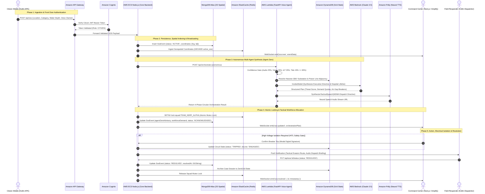

# ZeroGrid — Autonomous Emergency Response & Off-Grid Mesh Platform

> **Zero-Infrastructure Disaster Coordination & Circular Multi-Agent Crisis Engine Native to AWS**  
> Bridges peer-to-peer off-grid alerting across Android devices (BLE / LoRa / Wi-Fi Direct) with an autonomous 4-phase multi-agent crisis command center (Agent 0 + 160 Admin Workforce) and real-time operations running natively on **Amazon Web Services (AWS)**.

---

## Table of Contents

1. [System Architecture Overview (AWS Cloud Native)](#1-system-architecture-overview-aws-cloud-native)
2. [End-to-End Emergency Incident Lifecycle](#2-end-to-end-emergency-incident-lifecycle)
3. [Autonomous 4-Phase Circular Multi-Agent Pipeline](#3-autonomous-4-phase-circular-multi-agent-pipeline)
4. [160-Admin Workforce & Department Mapping](#4-160-admin-workforce--department-mapping)
5. [Monorepo & Codebase Structure](#5-monorepo--codebase-structure)
6. [AWS Infrastructure & Service Mapping](#6-aws-infrastructure--service-mapping)
7. [Off-Grid Mesh Protocol (Android Client)](#7-off-grid-mesh-protocol-android-client)
8. [Cloud Backend & Real-Time API (`backend/`)](#8-cloud-backend--real-time-api-backend)
9. [Command Center & Web Dashboard (`frontend/`)](#9-command-center--web-dashboard-frontend)
10. [Voice-AI Dispatch Assistant (`voice-agent/`)](#10-voice-ai-dispatch-assistant-voice-agent)
11. [Android Native Client (`gridzero/`)](#11-android-native-client-gridzero)
12. [Setup & Quickstart Guide](#12-setup--quickstart-guide)
13. [Security, Identity & Resilience Model](#13-security-identity--resilience-model)

---

## 1. System Architecture Overview (AWS Cloud Native)

ZeroGrid provides continuous disaster coordination even during complete power and cellular communication blackouts. The entire platform is architected natively across five modular AWS tiers:

```
┌────────────────────────────────────────────────────────────────────────────────────────┐
│                        1. PEOPLE, DEVICES & EDGE CLIENTS                               │
│                                                                                        │
│   [Citizen App (Kotlin)] ────(BLE / LoRa Mesh)────► [Offline Peer Relay Mesh]          │
│            │                                                    │                      │
│            ▼ (HTTPS / WSS)                                      ▼                      │
│   ┌────────────────────────────────┐                 ┌──────────────────────┐          │
│   │ Command Center Web (Next.js)   │                 │ Dispatcher Responder │          │
│   │ Hosted on AWS Amplify          │                 │ (Kotlin Android APK) │          │
│   └────────────────┬───────────────┘                 └──────────┬───────────┘          │
└────────────────────┼────────────────────────────────────────────┼──────────────────────┘
                     │                                            │
                     ▼                                            ▼
┌────────────────────────────────────────────────────────────────────────────────────────┐
│                        2. AWS FRONT DOOR & INGRESS BOUNDARY                            │
│                                                                                        │
│   ┌──────────────────────┐    ┌───────────────────────────┐    ┌───────────────────┐   │
│   │     AWS Amplify      │───►│  Amazon Cognito Identity  │───►│ Amazon API Gateway│   │
│   │  (Next.js Dashboard) │    │      Pools + JWT Auth     │    │ (REST & WebSocket)│   │
│   └──────────────────────┘    └───────────────────────────┘    └─────────┬─────────┘   │
│                                                                          │             │
│   [AWS Secrets Manager] ──(Secure Credentials Ingestion)─────────────────┘             │
└──────────────────────────────────────────────────────────────────────────┼─────────────┘
                                                                           │
                                 ┌─────────────────────────────────────────┴─────────────┐
                                 ▼                                                       ▼
┌──────────────────────────────────────────────────┐  ┌──────────────────────────────────┐
│ 3. COMPUTE & MULTI-AGENT RUNTIME                 │  │ 4. GENERATIVE AI & REASONING     │
│                                                  │  │                                  │
│  ┌────────────────────────────────────────────┐  │  │  ┌────────────────────────────┐  │
│  │ AWS Lambda (FastAPI Voice Microservice)    │──┼──┼─►│ AWS Bedrock Runtime        │  │
│  │ • Acoustic Ingestion & Feature Extraction  │  │  │  │ • Anthropic Claude 3.5     │  │
│  │ • Electrical Adjacency Solver              │  │  │  │ • NDMA Situation Reports   │  │
│  └─────────────────────┬──────────────────────┘  │  │  │ • Executive Directives     │  │
│                        │                         │  │  └────────────────────────────┘  │
│                        ▼                         │  │                                  │
│  ┌────────────────────────────────────────────┐  │  │  ┌────────────────────────────┐  │
│  │ Agent Zero Autonomous Crisis Orchestrator  │  │  │  │ Amazon Polly               │  │
│  │ 1. Confidence Gate   2. Classification     │◄─┼──┼──│ • Neural Text-to-Speech   │  │
│  │ 3. Demand Quota      4. Workforce Allocate │  │  │  │ • Audible Tactical Dispatch│  │
│  └─────────────────────┬──────────────────────┘  │  │  └────────────────────────────┘  │
│                        │                         │  └──────────────────────────────────┘
│                        ▼ (WebSockets / REST)     │
│  ┌────────────────────────────────────────────┐  │
│  │ AWS ECS Fargate (Express Node.js Service)  │  │
│  │ • Socket.io /sos Real-Time Channel         │  │
│  │ • 24h Predictive Chaos Physics Engine      │  │
│  │ • 5-Min Spatial DBSCAN Batch Dispatch      │  │
│  └─────────────────────┬──────────────────────┘  │
└────────────────────────┼─────────────────────────┘
                         │
                         ▼
┌────────────────────────────────────────────────────────────────────────────────────────┐
│                        5. DISTRIBUTED PERSISTENCE & SPATIAL CACHES                     │
│                                                                                        │
│   ┌─────────────────────────┐  ┌───────────────────────────┐  ┌────────────────────┐   │
│   │      MongoDB Atlas      │  │   Amazon DynamoDB State   │  │ Redis ElastiCache  │   │
│   │ • GeoJSON 2dsphere SOS  │  │ • Single-Table Grid Graph │  │ • Squad Mutex Locks│   │
│   │ • Active Citizen Tickets│  │ • 33kV/11kV Substation Map│  │ • Spatial Lookups  │   │
│   │ • 160-Admin Directory   │  │ • Finished Case Archives  │  │ • Socket Pub/Sub   │   │
│   └─────────────────────────┘  └───────────────────────────┘  └────────────────────┘   │
└────────────────────────────────────────────────────────────────────────────────────────┘
```

---

## 2. End-to-End Emergency Incident Lifecycle

The following sequence illustrates the complete end-to-end lifecycle of an emergency alert, from citizen creation in the field through AWS Front Door verification, multi-agent AI synthesis, electrical breaker actuation, and field squad dispatch:



### Detailed Lifecycle Steps

1. **Incident Trigger**: Citizen initiates distress beacon on Android app. If mobile cell tower is down, beacon is forwarded hop-by-hop across the offline LoRa/BLE mesh network until a mule peer reaches an active gateway.
2. **AWS Ingress & Authentication**: Requests enter through **Amazon API Gateway**, validated against **Amazon Cognito** user pool tokens, while **AWS Secrets Manager** injects credentials securely into downstream runtimes.
3. **Core Ingestion & Geolocation**: The containerized **Node.js Express** backend on **AWS ECS / Fargate** persists the active ticket in **MongoDB Atlas** using 2dsphere indexing and publishes an immediate alert over Socket.io `/sos` namespace.
4. **Autonomous Multi-Agent Orchestration**: Backend invokes **AWS Lambda (FastAPI)** running **Agent Zero**:
   - **Confidence Gating**: Corroborates audio clamor, aerial satellite data, IoT water probes, and astronomical tides ($\ge 65\%$ threshold).
   - **Electrical Grid Resolver**: Traverses **Amazon DynamoDB** electrical topology to isolate low-lying transformer plinths and secure hospital ICU tie-lines.
   - **Reasoning with AWS Bedrock**: Prompts Anthropic Claude 3.5 Sonnet to draft NDMA Situation Reports and tactical equipment quotas.
   - **Audio Generation via Amazon Polly**: Generates neural voice dispatches for first responders.
5. **Workforce Allocation & Collision Prevention**: Matches required tactical skill loadouts across the 160-Admin roster. **Amazon ElastiCache (Redis)** distributed mutex locks guarantee no squad can be double-booked.
6. **Field Execution & Grid Protection**: Emergency responders receive real-time evasion corridors computed by **Amazon Location Service v2**, while high-voltage breaker trips execute under Human-in-the-Loop (HITL) authorization.
7. **Resolution & Archival**: Responders mark tickets resolved, releasing squad mutex locks in Redis, marking MongoDB events `RESOLVED`, and archiving completed incident dossiers in DynamoDB.

---

## 3. Autonomous 4-Phase Circular Multi-Agent Pipeline

To prevent emergency dispatch hallucination, operator overload, and false alarm panic, all incoming distress alerts execute through an automated, circular multi-agent pipeline:

$$\text{Confidence Calculator } (\ge 65\%) \longrightarrow \text{Agent 0 Gatekeeper} \longrightarrow \text{4 Crisis Sub-Agents} \longrightarrow \text{Agent 0 Workforce Allocation}$$

```
  [ INCOMING CITIZEN SOS / SENSOR TELEMETRY ]
                     │
                     ▼
  ┌─────────────────────────────────────────────────────────┐
  │ PHASE 1: CONFIDENCE CALCULATOR AGENT                    │
  │ • Audio Spectrum (25%)   • Visual Spectrum (35%)        │
  │ • Submersible Depth (25%) • Coastal Tide Surge (15%)    │
  │ Gate: Score >= 65% (Filters clear-sky sensor artifacts) │
  └──────────────────────────┬──────────────────────────────┘
                             │ Passed (>= 65%)
                             ▼
  ┌─────────────────────────────────────────────────────────┐
  │ PHASE 2: AGENT 0 GATEKEEPER & INTAKE                    │
  │ • Spatial Deduplication on Grid Node Adjacency List     │
  │ • Priority Scoring & Threat Tier Indexing (0–100)       │
  │ • Autonomous Domain Routing (Flood, Heat, Grid, Rescue) │
  └──────────────────────────┬──────────────────────────────┘
                             │ Routed Domain
                             ▼
  ┌─────────────────────────────────────────────────────────┐
  │ PHASE 3: SPECIALIZED CRISIS SUB-AGENTS                  │
  │ 1. Flood Management Sub-Agent                           │
  │ 2. Heatwave Management Sub-Agent                        │
  │ 3. Power Grid Operations Sub-Agent                      │
  │ 4. Rescue Management Sub-Agent                          │
  │ • Formulates Squad Demand Quota & Required Tactical Tags│
  │ • Declares Fallback Department & Ground Hazards         │
  └──────────────────────────┬──────────────────────────────┘
                             │ Submits Demand Quota
                             ▼
  ┌─────────────────────────────────────────────────────────┐
  │ PHASE 4: AGENT 0 WORKFORCE ALLOCATION & ITERATIVE LOOP  │
  │ • Queries 160 MongoDB Administrative Personnel Roster   │
  │ • Atomic Redis Lock to prevent duplicate squad claims   │
  │ • Round 1: Matches Primary Department by Tactical Tags  │
  │ • Shortfall Detected? -> Iterative Fallback Negotiation │
  │ • Round 2: Engages Fallback Department Squads           │
  │ • Locks units, updates incident, and emits Socket.io    │
  └─────────────────────────────────────────────────────────┘
```

### Safety Gateways & Critical Infrastructure Protocols

- **Hospital Lifeline ICU Protection**: Guarantees Sanjeevani Hospital ICU busbars switch to standby 33kV tie lines with 0ms interruption before primary substation isolation.
- **Human-in-the-Loop (HITL) Circuit Breakers**: High-voltage electrical trips require Incident Commander digital sign-off via modal validation before executing switchyard lock-out/tag-out.

---

## 4. 160-Admin Workforce & Department Mapping

The system manages a pre-seeded roster of **160 Admin accounts** in MongoDB (`User` collection with `role: "ADMIN"`), partitioned symmetrically into four crisis management departments (40 personnel each):

| Department Tag          | Headcount | Primary Tactical Tags / Equipment                      | Iterative Fallback Department |
| ----------------------- | --------- | ------------------------------------------------------ | ----------------------------- |
| `FLOOD_MANAGEMENT`      | 40 Admins | `DEWATERING`, `DEEP_WATER_RESQ`, `ZODIAC_BOAT`         | `RESCUE_MANAGEMENT`           |
| `HEATWAVE_MANAGEMENT`   | 40 Admins | `MEDICAL_TRIAGE`, `HYDRATION_SQUAD`, `COOLING_STATION` | `RESCUE_MANAGEMENT`           |
| `POWER_GRID_MANAGEMENT` | 40 Admins | `HV_LINEMAN`, `SUBSTATION_CREW`, `AIR_GAP_ISOLATION`   | `RESCUE_MANAGEMENT`           |
| `RESCUE_MANAGEMENT`     | 40 Admins | `HEAVY_RESCUE`, `COLLAPSE_SEARCH`, `TRAUMA_PARAMEDIC`  | `FLOOD_MANAGEMENT`            |

- **Live Workforce Telemetry**: Exposed via `GET /api/admin/workforce/stats`, providing real-time idle vs assigned counts per department.
- **Collision Defense**: AWS ElastiCache / Redis mutex locks guarantee that squads (e.g. `TEAM_NDRF_ALPHA`) committed to an active incident cannot be double-booked during concurrent dispatches.

---

## 5. Monorepo & Codebase Structure

```
AndroidStudioProjects/
├── gridZeroExpress/                        # Unified Cloud Backend & Web Command Console
│   ├── backend/                            # Express 5 + MongoDB + Socket.IO Server (AWS ECS)
│   │   ├── src/controllers/                # Flow, SOS, Admin, Predictive Hydrodynamics
│   │   ├── src/models/                     # User (160 Admins), SosEvent, ParentChildLink
│   │   ├── src/routes/                     # REST API endpoints & Auth guards
│   │   └── src/utils/                      # Chaos Prediction, Tide/Weather, Grid resolver
│   │
│   ├── frontend/                           # Next.js 16 (React 19, Tailwind v4) on AWS Amplify
│   │   ├── public/maplibre-gl-worker.mjs   # Static MapLibre Web Worker (Fixes Next.js MIME block)
│   │   ├── src/app/(app)/dashboard/        # Agent Zero Command Center (Telemetry Graphs & KPIs)
│   │   ├── src/app/(app)/prediction/       # 24-Hour Multi-Domain Chaos Prediction Console
│   │   ├── src/app/(app)/flow/             # Autonomous Multi-Agent Interactive Test Bench
│   │   ├── src/app/(app)/admin/            # Master Incident Map & Operations Console
│   │   ├── src/components/admin/           # DashboardAnalyticsGraphs, SosLiveMap (Amazon Location)
│   │   ├── src/components/voice/           # Tactical Voice-AI Assistant
│   │   └── src/lib/voiceAgent.ts           # Autonomous Orchestration & Fallback Engine
│   │
│   ├── voice-agent/                        # Serverless Voice-AI Microservice on AWS Lambda
│   │   ├── main.py                         # FastAPI + Mangum Serverless Adapter
│   │   ├── grid_graph.py                   # Single-Table DynamoDB Adjacency Graph Engine
│   │   └── seed_dynamodb.py                # DynamoDB Electrical Topology Seeding Utility
│   │
│   └── postman/                            # Postman API test collection
│
└── gridzero/                               # Native Android Client (Kotlin / Jetpack Compose)
    └── app/src/main/java/com/example/zerogrid/
        ├── mesh/                           # BLE/Wi-Fi Direct engines, routing & LRU cache
        ├── emergency/                      # Unified SOS Dispatcher & WorkManager sync
        ├── admin/                          # Tactical radar canvas, live maps, responder claims
        └── service/                        # Foreground BLE Mesh Service & FCM Push receiver
```

---

## 6. AWS Infrastructure & Service Mapping

| AWS Service                    | Configuration & Role in ZeroGrid                                                                                                                 |
| ------------------------------ | ------------------------------------------------------------------------------------------------------------------------------------------------ |
| **AWS Amplify**                | Hosting & edge SSR/SSG deployment for the Next.js 16 Web Command Center dashboard with zero-downtime CI/CD.                                      |
| **Amazon Cognito**             | Citizen and administrator identity management, MFA validation, and issuance of signed JWT tokens with granular role claims (`ADMIN`, `CITIZEN`). |
| **Amazon API Gateway**         | Central ingress proxy managing REST route dispatch, WebSocket connection handling, and rate-limiting.                                            |
| **AWS Secrets Manager**        | Encrypted key vault storing `MONGODB_URI`, AWS credentials, Groq API keys, and JWT secrets.                                                      |
| **AWS Lambda**                 | Serverless execution of the Python 3.11 FastAPI Voice Agent microservice and graph traversal engine.                                             |
| **AWS ECS / Fargate**          | High-availability Docker container hosting the Node.js Express core backend, Socket.io `/sos` namespace, and 24h Chaos Prediction Agent.         |
| **AWS Bedrock**                | Foundation model execution (Anthropic Claude 3.5 Sonnet) generating NDMA Situation Reports and strategic crisis briefings.                       |
| **Amazon Polly**               | Neural text-to-speech engine producing tactical field audio instructions for rescue responders.                                                  |
| **Amazon DynamoDB**            | Single-table adjacency store (`ZeroGrid-State`) maintaining 33kV/11kV electrical grid topology, breaker states, and archived case dossiers.      |
| **Amazon ElastiCache (Redis)** | In-memory distributed lock manager (`SETNX`), spatial geo-indexing, and real-time Socket.io multi-server pub/sub.                                |
| **Amazon Location Service v2** | Vector map tiles, geocoding, and multi-hazard emergency detour routing bypassing submerged streets and downed power lines.                       |

---

## 7. Off-Grid Mesh Protocol (Android Client)

### 7.1 Packet Envelope Specification

Every over-the-air packet utilizes a compact, deterministic JSON envelope:

```json
{
  "packetId": "d9b2e048-c89b-4b13-a7cf-e48f1082aa91",
  "senderId": "node-8f2a1b",
  "recipientId": "*",
  "ttl": 5,
  "hopCount": 0,
  "type": "SOS_BEACON",
  "payload": "{\"category\":\"MEDICAL\",\"message\":\"Injured leg\",\"lat\":19.0760,\"lng\":72.8777,\"ts\":1727337600000}",
  "timestamp": 1727337600000,
  "signature": ""
}
```

- **TTL & Loop Prevention**: Default `ttl = 5`. Decremented at each hop. Packets with `ttl <= 1` are dropped.
- **LRU Deduplication**: `DeduplicationCache.kt` maintains a synchronized 500-item LRU cache of `packetId` hashes to eliminate broadcast storms.
- **Transport Abstraction**:
  - **`BleMeshDriver`**: BLE Peripheral advertising & Central GATT scanning on Custom UUID `0000ZG01-0000-1000-8000-00805F9B34FB`. Handles MTU negotiation (up to 512 bytes) and segment reassembly.
  - **`WifiDirectMeshDriver`**: Android `WifiP2pManager` TCP socket streaming for high-throughput mesh bursts.
- **WorkManager Offline Queue**: When offline, `UnifiedSosDispatcher` enqueues `SosUploadWorker` with exponential backoff, ensuring zero alert loss upon reconnection.

---

## 8. Cloud Backend & Real-Time API (`backend/`)

Built on **Node.js 20/22 LTS**, **Express 5**, **Mongoose 9**, and **Socket.IO 4**.

### Core REST Endpoints

| Category       | Endpoint                                  | Method | Description                                                                |
| -------------- | ----------------------------------------- | ------ | -------------------------------------------------------------------------- |
| **Auth**       | `/api/auth/register`                      | `POST` | Register citizen/admin credentials.                                        |
|                | `/api/auth/login`                         | `POST` | Authenticate and issue 7-day signed JWT.                                   |
| **Emergency**  | `/api/sos`                                | `POST` | Ingest new SOS beacon (rate-limited). Triggers Agent Zero autonomous loop. |
|                | `/api/sos/active`                         | `GET`  | List active emergency alerts.                                              |
|                | `/api/sos/:id/resolve`                    | `PUT`  | **Admin Only.** Mark incident as resolved.                                 |
| **Workforce**  | `/api/admin/workforce/stats`              | `GET`  | Live availability of the 160 Admin departments.                            |
| **Flow Bench** | `/api/flow/run`                           | `POST` | Execute full 4-phase circular multi-agent pipeline.                        |
|                | `/api/flow/presets`                       | `GET`  | Retrieve emergency scenario benchmarks.                                    |
| **Predictive** | `/api/admin/predictive/24h-chaos`         | `GET`  | 24-hour multi-domain chaos trajectory, wire placements & staging.          |
|                | `/api/admin/predictive/preemptive-stage`  | `POST` | Dispatch preemptive standby orders to 160-admin roster.                    |
|                | `/api/admin/predictive/tide-summary`      | `GET`  | Real-time coastal tides and precipitation.                                 |
|                | `/api/admin/predictive/drainage-timeline` | `POST` | Hydrodynamic recession forecasting.                                        |
| **Routes**     | `/api/routes/optimize`                    | `POST` | Multi-factor waypoint sequence rescue matrix.                              |
|                | `/api/routes/detour`                      | `POST` | AWS Strands 3-tier routing engine bypassing active flood zones.            |

### Real-Time WebSocket Channel (`/sos` namespace)

- `sos:new`: Emitted immediately upon new incident registration.
- `sos:agent_zero_orchestrated`: Emitted when Agent 0 completes autonomous decisions.
- `sos:workforce:dispatched`: Emitted when administrative personnel are locked.
- `workforce:preemptively_staged`: Broadcast when preemptive 24h hazard standby orders are deployed.
- `flow:step:update`: Streamed step-by-step progress during pipeline execution.
- `sos:updated`: Broadcast upon status transitions (acknowledged, resolved, notes added).

---

## 9. Command Center & Web Dashboard (`frontend/`)

Built on **Next.js 16** (App Router), **React 19**, **Tailwind CSS v4**, and **MapLibre GL JS** on **AWS Amplify**:

- **Dashboard Command Center (`/dashboard`)**:
  - Real-time executive KPIs with embedded micro-sparklines (Inflow wave, Veracity stability, Workforce allocation, 50Hz ICU voltage sine wave).
  - Interactive 24-Hour Multi-Domain Threat & Chaos Curve with interactive hover scrubbers and series toggles.
  - 160-Admin Department Donut Allocation Chart and utilization progress bars.
  - Active Distress Command Feed with domain filters and search.
- **24-Hour Multi-Domain Chaos Prediction Console (`/prediction`)**:
  - Meteorological physics coupled to verified Open-Meteo precipitation ($<2\text{mm} \implies 0\text{cm}$ flood depth).
  - Dynamic disaster classification (`POST_MONSOON_THERMAL_SURGE`, `HIGH_WIND_GRID_EXPOSURE`, `COMPOUND_MONSOON_INUNDATION`).
  - "What Will Be Required Most" priority equipment quota cards (Misting Shelters, Lineman Toolkits, Dewatering Pumps).
  - Wire Placement Vulnerability Matrix (33kV overhead lines, 11kV hospital conduits).
- **Master Incident Operations (`/admin`)**:
  - Full-screen **Amazon Location Service v2** telemetry canvas with street-scale waterlogging rings and green evasion detour corridors.

---

## 10. Voice-AI Dispatch Assistant (`voice-agent/`)

Hands-free tactical dispatch assistant utilizing serverless inference on **AWS Lambda** (Python 3.11 + FastAPI + Mangum):

- **Speech-to-Text**: Groq `whisper-large-v3-turbo` with prompt conditioning (`ZeroGrid emergency disaster dispatch rescue team audio transcript`) and server-side silence anti-hallucination guards.
- **Reasoning LLM**: Groq `openai/gpt-oss-120b` generating structured incident triage, priority overrides, and tactical field notes.
- **Zero-CORS Route Proxy**: Client routes audio blobs through Next.js server route (`/api/voice-chat`) to keep cloud credentials secure.
- **Hardware Mic Visualizer**: Real-time Web Audio API energy meter with dynamic hardware device selection.

---

## 11. Android Native Client (`gridzero/`)

Built 100% in **Kotlin** and **Jetpack Compose (Material 3)** for Android 8.0+ (API 26 to 35):

- **High-Performance Navigation**: HorizontalPager root architecture with smooth sliding sub-screen transitions.
- **Tactical Radar & Maps**: Switchable between live maps and a zero-dependency concentric `Canvas` radar screen based on device compass orientation.
- **Background Radio Services**: `MeshForegroundService` maintains persistent BLE peripheral advertising and scanning with minimal battery consumption.
- **FCM Emergency Alerts**: `ZeroGridFirebaseMessagingService` delivers high-priority heads-up system notifications for urgent alerts.

---

## 12. Setup & Quickstart Guide

### Prerequisites

- **Node.js** v20+ LTS and **npm**
- **MongoDB** (local or Atlas cluster)
- **Python** 3.11+ (for local voice agent)
- **Android Studio Ladybug / Meerkat** (for Android client)
- **AWS CLI** configured (`aws configure` with `ap-south-1`)

### 1. Backend Server Setup

```bash
cd gridZeroExpress/backend
npm install
```

Configure `.env`:

```env
PORT=5000
MONGODB_URI=mongodb+srv://<user>:<password>@cluster.mongodb.net/zerogrid
JWT_SECRET=super_secret_jwt_key_at_least_32_characters_long
ALLOWED_ORIGINS=http://localhost:3000

# AWS Credentials (ap-south-1)
AWS_REGION=ap-south-1
AWS_ACCESS_KEY_ID=AKIA...
AWS_SECRET_ACCESS_KEY=...
AWS_BEDROCK_MODEL_ID=anthropic.claude-3-5-sonnet-20240620-v1:0

# Redis / ElastiCache (Atomic Squad Locking)
REDIS_HOST=zerogrid-redis-cluster.serverless.ap-south-1.cache.amazonaws.com
REDIS_PORT=6379

# Agent Zero Microservice Webhook & Push
VOICE_AGENT_LAMBDA_URL=https://<api-id>.execute-api.ap-south-1.amazonaws.com/default/voice-agent-microservice
```

Start server:

```bash
npm run dev
# Healthcheck: http://localhost:5000/health
```

### 2. Web Frontend Setup

```bash
cd gridZeroExpress/frontend
npm install
```

Configure `.env`:

```env
NEXT_PUBLIC_API_URL=http://localhost:5000
NEXT_PUBLIC_AWS_LOCATION_API_KEY=v1.public...
NEXT_PUBLIC_AWS_REGION=ap-south-1
NEXT_PUBLIC_AWS_LOCATION_MAP_NAME=default
GROQ_API_KEY=gsk_...
GROQ_MODEL=openai/gpt-oss-120b
NEXT_PUBLIC_VOICE_AGENT_URL=https://<api-id>.execute-api.ap-south-1.amazonaws.com/default/voice-agent-microservice
```

Start frontend:

```bash
npm run dev
# Open http://localhost:3000
```

### 3. Voice-AI Microservice & DynamoDB Seeding

```bash
cd voice-agent
python -m venv venv
source venv/bin/activate  # Windows: .\venv\Scripts\activate
pip install -r requirements.txt

# Seed electrical grid topology to AWS DynamoDB
python seed_dynamodb.py

# Run local FastAPI dev server
uvicorn main:app --reload --port 8000
```

---

## 13. Security, Identity & Resilience Model

| Domain                  | Security Mechanism           | Resilience Guarantee                                                                                  |
| ----------------------- | ---------------------------- | ----------------------------------------------------------------------------------------------------- |
| **API Transport**       | TLS 1.3 / HTTPS              | All credentials, telemetry, and audio payloads encrypted in transit through Amazon API Gateway.       |
| **Authentication**      | Amazon Cognito + JWT         | Stateless token rotation with claims-based verification (`ADMIN`, `CITIZEN`).                         |
| **Admin Authorization** | Database Role Guard          | Re-verifies MongoDB Atlas on each privileged administrative endpoint (`role === 'ADMIN'`).            |
| **Workforce Locking**   | Redis ElastiCache Mutex      | Atomic `SETNX` locks eliminate squad contention and race conditions during simultaneous dispatches.   |
| **Credential Safety**   | AWS Secrets Manager          | Zero hardcoded keys in codebase; dynamically fetched at runtime.                                      |
| **Spatial Indexing**    | MongoDB `2dsphere`           | Fast geospatial lookahead without exposing sequential ID leaks.                                       |
| **Vector Map Engine**   | Amazon Location Service v2   | Secure vector tiles in `ap-south-1` rendered via MapLibre GL JS with static Web Worker.               |
| **Offline Resilience**  | Android WorkManager & LoRa   | Failed offline uploads automatically retry upon network recovery.                                     |
| **AI Reliability**      | 3-Tier Multi-Engine Fallback | AWS Bedrock (Claude 3.5 Sonnet) $\to$ Groq LPU $\to$ Deterministic Safety Matrix ensures 100% uptime. |

---

<div align="center">
  <sub>ZeroGrid &bull; Built for Autonomous Disaster Resilience, AWS Cloud Native Operations, and Mesh Communication</sub>
</div>
