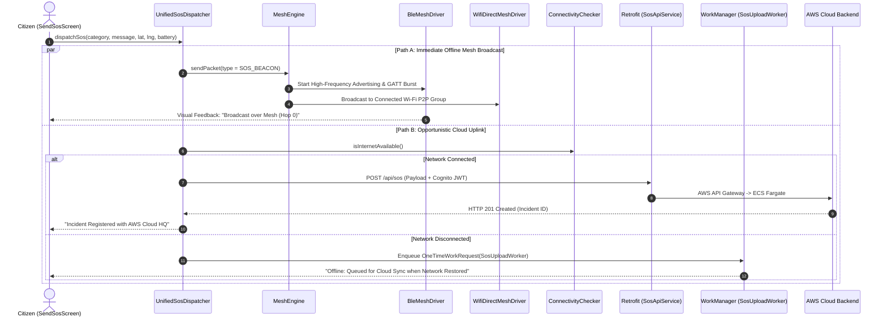

# ZeroGrid Mobile Application Working Core

> **Android Native Client (`app/`) Architecture, Hardware Mesh Engine & AWS Cloud Integration Guide**  
> Built 100% in **Kotlin** and **Jetpack Compose (Material 3)** for Android 8.0+ (API 26–35). Bridges peer-to-peer off-grid alerting across local radios (BLE / Wi-Fi Direct) with an autonomous cloud backend on **Amazon Web Services (AWS)** via **Amazon API Gateway**, **AWS Cognito**, **AWS ECS Fargate (AgentZero powered by Strands Agents SDK)**, and **Amazon Bedrock**.

---

## Table of Contents

1. [Ecosystem & Dual-Mode Topology](#1-ecosystem--dual-mode-topology)
2. [Complete Mobile Package Architecture](#2-complete-mobile-package-architecture)
3. [Dual-Path SOS Dispatch Engine](#3-dual-path-sos-dispatch-engine)
   - 3.1 [Path A: Offline Radio Mesh (BLE & Wi-Fi Direct)](#31-path-a-offline-radio-mesh-ble--wi-fi-direct)
   - 3.2 [Path B: AWS Cloud Uplink (API Gateway & ECS AgentZero)](#32-path-b-aws-cloud-uplink-api-gateway--ecs-agentzero)
4. [Mesh Protocol & Packet Specification](#4-mesh-protocol--packet-specification)
   - 4.1 [Deterministic Packet Envelope](#41-deterministic-packet-envelope)
   - 4.2 [Packet Types & Handlers](#42-packet-types--handlers)
   - 4.3 [Multi-Hop Routing, TTL & Loop Prevention](#43-multi-hop-routing-ttl--loop-prevention)
   - 4.4 [Hardware Transport Drivers](#44-hardware-transport-drivers)
   - 4.5 [LRU Deduplication Engine](#45-lru-deduplication-engine)
5. [AWS Cloud Integration Layer](#5-aws-cloud-integration-layer)
   - 5.1 [Security & JWT Authentication (Cognito)](#51-security--jwt-authentication-cognito)
   - 5.2 [REST API Integration (Retrofit & OkHttp)](#52-rest-api-integration-retrofit--okhttp)
   - 5.3 [Real-Time WebSocket Streaming (Socket.io)](#53-real-time-websocket-streaming-socketio)
   - 5.4 [Tactical Voice Copilot (`[Lambda A1]` & Amazon Bedrock)](#54-tactical-voice-copilot-lambda-a1--amazon-bedrock)
6. [Emergency Navigation & Hazard Avoidance Subsystem](#6-emergency-navigation--hazard-avoidance-subsystem)
   - 6.1 [Safe Route Copilot & Detour Planner](#61-safe-route-copilot--detour-planner)
   - 6.2 [Hazard Radar & Dynamic Overlay Manager](#62-hazard-radar--dynamic-overlay-manager)
7. [Navigation Stack & Screen Architecture](#7-navigation-stack--screen-architecture)
   - 7.1 [Root HorizontalPager Navigation](#71-root-horizontalpager-navigation)
   - 7.2 [Animated Sub-Screen Stack](#72-animated-sub-screen-stack)
8. [Tactical Mobile Admin Panel](#8-tactical-mobile-admin-panel)
   - 8.1 [Google Maps Mode vs. Tactical Radar Canvas](#81-google-maps-mode-vs-tactical-radar-canvas)
   - 8.2 [Incident Claiming & Dispatcher Workflow](#82-incident-claiming--dispatcher-workflow)
9. [Background Persistence & Device Resilience](#9-background-persistence--device-resilience)
   - 9.1 [Persistent Foreground BLE Mesh Service](#91-persistent-foreground-ble-mesh-service)
   - 9.2 [Offline WorkManager Upload with Exponential Backoff](#92-offline-workmanager-upload-with-exponential-backoff)
   - 9.3 [High-Priority FCM Push Receiver](#93-high-priority-fcm-push-receiver)
10. [Build Configuration, Secrets & Setup](#10-build-configuration-secrets--setup)

---

## 1. Ecosystem & Dual-Mode Topology

The ZeroGrid Android client operates under a zero-assumption network model: it guarantees uninterrupted life-safety communication whether operating during a total cellular/power blackout or connected to high-speed internet.

```
┌────────────────────────────────────────────────────────────────────────────────────────┐
│                              OFF-GRID LOCAL DISASTER AREA                              │
│                                                                                        │
│   [Citizen A (Sender)] ───(BLE GATT / Wi-Fi P2P)───► [Citizen B (Relay Node)]          │
│            │                                                    │                      │
│      (No Cellular)                                        (BLE / Wi-Fi P2P)            │
│            │                                                    ▼                      │
│            └────────────────────────────────────────► [Citizen C (Opportunistic Mule)] │
└─────────────────────────────────────────────────────────────────┬──────────────────────┘
                                                                  │ (Cellular / Starlink / Wi-Fi)
                                                                  ▼
┌────────────────────────────────────────────────────────────────────────────────────────┐
│                              AWS CLOUD BACKEND PLATFORM                                │
│                                                                                        │
│   ┌───────────────────────────┐        ┌───────────────────────────────────────────┐   │
│   │ Amazon Cognito User Pools │◄───────┤     AWS API Gateway / CloudFront CDN      │   │
│   │ (JWT Signature Validate)  │        │ (HTTPS REST & WebSocket /sos Ingress)     │   │
│   └───────────────────────────┘        └─────────────────────┬─────────────────────┘   │
│                                                              │                         │
│                  ┌───────────────────────────────────────────┴───────────────┐         │
│                  ▼ (Voice Audio Stream)                                      ▼         │
│   ┌─────────────────────────────────────────┐   ┌──────────────────────────────────┐   │
│   │ [Lambda A1] Voice Agent Hook            │   │ AWS ECS Fargate Container        │   │
│   │ (FastAPI + Mangum -> Bedrock Haiku)     │   │ (AgentZero via Strands SDK)      │   │
│   └─────────────────────────────────────────┘   └──────────────────┬───────────────┘   │
│                                                                    │                   │
│                                           ┌────────────────────────┴────────┐          │
│                                           ▼                                 ▼          │
│                            ┌─────────────────────────────┐   ┌─────────────────────┐   │
│                            │ MongoDB Atlas (2dsphere)    │   │ ElastiCache Redis   │   │
│                            │ (Active Incidents & Rescuer)│   │ (Redlock & Cache)   │   │
│                            └─────────────────────────────┘   └─────────────────────┘   │
└────────────────────────────────────────────────────────────────────────────────────────┘
```

---

## 2. Complete Mobile Package Architecture

The Kotlin Android client is located in `app/src/main/java/com/example/zerogrid/`:

```text
com.example.zerogrid/
├── MainActivity.kt                # Single-activity Compose entrypoint, hardware observer & back-handler
├── ZeroGridApplication.kt        # Application lifecycle, Notification Channels & singleton initialization
│
├── admin/                         # Mobile Admin Command Module
│   ├── AdminPanelScreen.kt        # Master Admin Interface (Tabs: Map/Radar, Incident History, User Roster)
│   ├── data/                      # Admin Retrofit APIs, AdminSosRepository & AdminSocketManager
│   └── ui/                        # AdminGoogleMapView, TacticalRadarCanvas, SosDetailBottomSheet
│
├── auth/                          # Identity & Cloud Authentication
│   ├── LoginScreen.kt             # Email/Password & Google Sign-In interface
│   ├── RegisterScreen.kt          # Citizen account creation
│   └── CompleteProfileScreen.kt   # Emergency phone number & blood group completion
│
├── contacts/                      # Emergency Contacts Subsystem
│   ├── EmergencyContactsScreen.kt # Local ICE (In Case of Emergency) contacts UI
│   └── ContactsViewModel.kt       # Room / Cloud CRUD repository sync
│
├── debug/                         # Diagnostic & Field Radio Telemetry
│   ├── DebugConsoleScreen.kt      # In-memory logging ring buffer & packet transmission graph
│   └── LogBuffer.kt               # Thread-safe circular buffer for offline radio diagnostics
│
├── emergency/                     # Unified SOS, Route Planning & Safety Agents
│   ├── SendSosScreen.kt           # 1-Tap Emergency Trigger with Category, Message & Location
│   ├── SosCenterScreen.kt         # Incident monitoring, local radar broadcast & safe acknowledgement
│   ├── TrackSosScreen.kt          # Real-time incident tracker with ETA, Rescuer status & live chat
│   ├── SafeRouteCopilotScreen.kt  # Real-time evacuation HUD bypassing waterlogging hazards
│   ├── SafeRoutePlannerDialog.kt  # Interactive origin/destination detour selector
│   ├── RouteCopilotViewModel.kt   # State holder for Strands Agent detour routes
│   ├── RouteSafetyAgent.kt        # Client-side validation of hazard proximity & impassable road alerts
│   ├── HazardOverlayView.kt       # Dynamic Canvas/Map rendering of flood polygons & debris zones
│   ├── OverlayAlertManager.kt     # System alert banner for sudden high-water or breaker trip warnings
│   ├── UnifiedSosDispatcher.kt    # Dual-dispatch orchestrator (Parallel Mesh + Cloud Uplink)
│   └── SosUploadWorker.kt         # WorkManager background worker for opportunistic cloud upload
│
├── family/                        # Family Location Tracking & Geofencing
│   ├── FamilyLinksScreen.kt       # Dependent child/elder tracking interface
│   └── FamilyViewModel.kt         # Real-time GPS coordinates query with authorization guards
│
├── fcm/                           # Firebase Cloud Messaging
│   └── ZeroGridFcmService.kt      # High-priority alert notification channel builder
│
├── hardware/                      # System Radios Observer
│   ├── HardwareStateManager.kt    # Monitors Bluetooth, Wi-Fi P2P & GPS location hardware states
│   └── HardwareRequirementBanner.kt # Contextual warning bar prompting user when radios are disabled
│
├── home/                          # Primary Dashboard
│   ├── MeshDashboardScreen.kt     # Peer count badge, nearby hazard summaries & SOS launchpad
│   └── HomeViewModel.kt           # Aggregator for active incidents and mesh radio density
│
├── location/                      # Geospatial Helpers
│   ├── LocationHelper.kt          # FusedLocationProviderClient wrapper (high-accuracy GPS tagger)
│   └── LocationSearchHelper.kt    # Offline reverse-geocoding and landmark coordinate resolution
│
├── mesh/                          # Autonomous Off-Grid Radio Mesh Engine
│   ├── engine/
│   │   ├── MeshEngine.kt          # Central singleton managing PeerTable, state flows & packet routing
│   │   ├── MeshRoutingEngine.kt   # Distance-vector multi-hop route calculator
│   │   ├── DeduplicationCache.kt  # Synchronized 500-slot LRU cache preventing broadcast loops
│   │   ├── MeshPacket.kt          # Immutable data class for over-the-air packets
│   │   └── PacketType.kt          # Enumeration of packet classifications
│   └── transport/
│       ├── BleMeshDriver.kt       # BLE Advertising (Peripheral) & GATT Scanning (Central)
│       └── WifiDirectMeshDriver.kt# Android WifiP2pManager Wi-Fi Direct socket streamer
│
├── messaging/                     # Mesh Communications
│   ├── MessagesScreen.kt          # Conversations list (Public channels & Private 1:1 chats)
│   ├── PeerDirectChatScreen.kt    # End-to-end direct peer messaging over BLE GATT
│   └── ChannelChatScreen.kt       # Regional broadcast channel (e.g. #EMERGENCY-BROADCAST)
│
├── navigation/                    # Pager Architecture & Screen Registry
│   ├── NavGraph.kt                # Custom HorizontalPager + AnimatedContent sub-screen stack
│   └── Routes.kt                  # Type-safe enum of all app destinations
│
├── network/                       # Cloud Networking
│   ├── ApiConstants.kt            # Base URLs (CloudFront / API Gateway / EB endpoints)
│   ├── RetrofitInstance.kt        # OkHttp client with JWT bearer interceptor & timeouts
│   ├── SosApiService.kt           # Retrofit interface for SOS lifecycle & Detour routes
│   └── SocketManager.kt           # Socket.io client maintaining connection to `/sos` namespace
│
├── onboarding/                    # First-Time Setup
│   ├── SplashScreen.kt            # Identity check and token validation
│   ├── PermissionsScreen.kt       # Runtime permissions requester (BLE, Location, Notifications)
│   └── CreateIdentityScreen.kt    # Offline nickname and crypto node-ID setup
│
├── profile/                       # User Profile & Medical Identifiers
│   └── ProfileScreen.kt           # Emergency blood type, emergency contacts & allergy notes
│
├── service/                       # Long-Running Android Services
│   └── MeshForegroundService.kt   # Persistent background notification service keeping radios alive
│
├── settings/                      # Preferences & Diagnostic Tools
│   └── SettingsScreen.kt          # Radio toggles, admin entry gate, and cache purgers
│
├── ui/                            # Design Tokens & Shared Primitives
│   ├── theme/                     # Material 3 colors, typography, shapes & dynamic AMOLED dark theme
│   └── components/                # NearbyHazardsRadarCard, Glassmorphic cards, StatusPills
│
└── util/                          # Validation & Formatting Utilities
    └── PhoneValidator.kt          # E.164 phone number parser
```

---

## 3. Dual-Path SOS Dispatch Engine

When a user taps **"Send SOS"**, [UnifiedSosDispatcher.kt](file:///c:/Users/ACER/AndroidStudioProjects/gridzero/app/src/main/java/com/example/zerogrid/emergency/UnifiedSosDispatcher.kt) executes a dual-path parallel dispatch strategy:



---

## 4. Mesh Protocol & Packet Specification

### 4.1 Deterministic Packet Envelope

All transmissions across Bluetooth LE and Wi-Fi Direct are encapsulated in a compact UTF-8 JSON structure:

```json
{
  "packetId": "d9b2e048-c89b-4b13-a7cf-e48f1082aa91",
  "senderId": "node-8f2a1b",
  "recipientId": "*",
  "ttl": 5,
  "hopCount": 0,
  "type": "SOS_BEACON",
  "payload": "{\"category\":\"MEDICAL\",\"message\":\"Trapped on rooftop\",\"lat\":19.4564,\"lng\":72.8258,\"accuracy\":5.2,\"battery\":82,\"senderName\":\"Citizen\",\"ts\":1773321600000}",
  "timestamp": 1773321600000,
  "signature": ""
}
```

| Field | Type | Description |
| :--- | :--- | :--- |
| `packetId` | `String` (UUIDv4) | Globally unique identifier used across the mesh for deduplication. |
| `senderId` | `String` | Originating Node ID (derived from device public key or hardware hash). |
| `recipientId` | `String` | Target Node ID, or `"*"` for broadcast packets. |
| `ttl` | `Int` | Time-to-Live hop countdown (default: `5`). Decremented at each hop. |
| `hopCount` | `Int` | Diagnostic counter (starts at `0`, incremented at each hop). |
| `type` | `PacketType` | Packet type determining internal unpacking logic. |
| `payload` | `String` | Serialized JSON string containing coordinates, battery %, and message. |
| `timestamp` | `Long` | Epoch millisecond timestamp at generation. |
| `signature` | `String` | Cryptographic signature slot (Ed25519 signing). |

### 4.2 Packet Types & Handlers

| PacketType | Delivery Scope | Payload Contents | Handled By |
| :--- | :--- | :--- | :--- |
| `SOS_BEACON` | **Broadcast (`*`)** | Coordinates, accuracy, category, message, sender name | `SosCenterScreen`, `UnifiedSosDispatcher` |
| `DIRECT_MESSAGE` | **Unicast (Node ID)**| Encrypted private message text, message ID, timestamp | `PeerDirectChatScreen`, `MessageStore` |
| `CHANNEL_MESSAGE`| **Broadcast (`*`)** | Public channel name, message text, sender alias | `ChannelChatScreen`, `MessageStore` |
| `PEER_ANNOUNCE` | **Broadcast (`*`)** | Node capabilities, battery %, channel mode, display name | `PeerTable`, `MeshDashboardScreen` |
| `PEER_GOODBYE` | **Broadcast (`*`)** | Node ID signaling graceful disconnect | `PeerTable` (evicts peer) |
| `ROUTE_REQUEST` | **Broadcast (`*`)** | Target node ID being searched | `MeshRoutingEngine` |
| `ROUTE_REPLY` | **Unicast** | Routing table metric and next-hop address | `MeshRoutingEngine` |
| `ACK` | **Unicast** | Confirmed `packetId` | Direct transport acknowledgment |

### 4.3 Multi-Hop Routing, TTL & Loop Prevention

```
[Packet Ingress from BLE or Wi-Fi Direct]
                  │
                  ▼
   DeduplicationCache.contains(packetId)?
      ├── YES ──► [DROP PACKET IMMEDIATELY] (Prevents broadcast storms)
      └── NO  ──► Commit packetId to LRU Cache
                  │
                  ▼
   Is recipientId == localNodeId OR "*"?
      ├── YES ──► Parse payload & dispatch to UI (SosCenter / Chat)
      └── NO  ──► Skip local delivery
                  │
                  ▼
   Is TTL > 1?
      ├── NO  ──► [DROP PACKET] (Reached max hop horizon)
      └── YES ──► Copy packet:
                    ttl = ttl - 1
                    hopCount = hopCount + 1
                  Forward to all peers in PeerTable EXCLUDING sender
```

### 4.4 Hardware Transport Drivers

* **`BleMeshDriver.kt`**:
  * Advertises custom ZeroGrid Service UUID: `0000ZG01-0000-1000-8000-00805F9B34FB`.
  * Bidirectional GATT Characteristic: `0000ZG02-0000-1000-8000-00805F9B34FB`.
  * MTU negotiation up to 512 bytes with packet segmentation and reassembly.
* **`WifiDirectMeshDriver.kt`**:
  * Implements Android `WifiP2pManager` to discover high-bandwidth Wi-Fi Direct groups.
  * Opens TCP sockets across the P2P group for peer-to-peer data burst streaming.

### 4.5 LRU Deduplication Engine

`DeduplicationCache.kt` utilizes a thread-safe `LinkedHashMap` configured as a Least-Recently-Used (LRU) cache with a maximum capacity of **500 packet IDs**. Any duplicate packet received within this window returns `false`, preventing re-transmission loops.

---

## 5. AWS Cloud Integration Layer

### 5.1 Security & JWT Authentication (Cognito)
All outbound cloud HTTP calls attach an AWS Cognito User Pool Bearer token:
```kotlin
class AuthInterceptor(private val tokenProvider: () -> String?) : Interceptor {
    override fun intercept(chain: Interceptor.Chain): Response {
        val request = chain.request().newBuilder()
        tokenProvider()?.let { token ->
            request.addHeader("Authorization", "Bearer $token")
        }
        return chain.proceed(request.build())
    }
}
```

### 5.2 REST API Integration (Retrofit & OkHttp)
Defined in [RetrofitInstance.kt](file:///c:/Users/ACER/AndroidStudioProjects/gridzero/app/src/main/java/com/example/zerogrid/network/RetrofitInstance.kt) and [ApiConstants.kt](file:///c:/Users/ACER/AndroidStudioProjects/gridzero/app/src/main/java/com/example/zerogrid/network/ApiConstants.kt):
* `POST /api/sos`: Triggers emergency incident on ECS Fargate backend.
* `GET /api/sos/active`: Queries active emergencies within proximity.
* `POST /api/routes/detour`: Calls **AWS Strands Agent** to calculate a dynamic safe route bypassing active waterlogged flood zones.

### 5.3 Real-Time WebSocket Streaming (Socket.io)
When internet is active, [SocketManager.kt](file:///c:/Users/ACER/AndroidStudioProjects/gridzero/app/src/main/java/com/example/zerogrid/network/SocketManager.kt) maintains a persistent WSS connection to `/sos`:
* `sos:new`: New emergency alert dropped in the regional corridor.
* `sos:updated`: Incident claimed by first responder, status transitioned, or notes appended.

### 5.4 Tactical Voice Copilot (`[Lambda A1]` & Amazon Bedrock)
The app captures audio bursts and streams Base64 payloads to `[Lambda A1]`:
* Executed serverlessly on AWS Lambda using FastAPI + Mangum.
* Invokes **Amazon Bedrock (Claude 3 Haiku)** with low-temperature prompt constraints.
* Returns concise tactical instructions (under 35 words) and evacuation action tags within 800ms.

---

## 6. Emergency Navigation & Hazard Avoidance Subsystem

### 6.1 Safe Route Copilot & Detour Planner
In disaster scenarios, direct roads may be submerged or obstructed. The **Safe Route Copilot** integrates:
* [SafeRouteCopilotScreen.kt](file:///c:/Users/ACER/AndroidStudioProjects/gridzero/app/src/main/java/com/example/zerogrid/emergency/SafeRouteCopilotScreen.kt): Turn-by-turn evacuation navigation HUD.
* [SafeRoutePlannerDialog.kt](file:///c:/Users/ACER/AndroidStudioProjects/gridzero/app/src/main/java/com/example/zerogrid/emergency/SafeRoutePlannerDialog.kt): Dialog allowing citizens to pick origin/destination points.
* [RouteSafetyAgent.kt](file:///c:/Users/ACER/AndroidStudioProjects/gridzero/app/src/main/java/com/example/zerogrid/emergency/RouteSafetyAgent.kt): Evaluates live vehicle coordinates against known hazard boundaries and prompts the backend for rerouting.

### 6.2 Hazard Radar & Dynamic Overlay Manager
* [HazardOverlayView.kt](file:///c:/Users/ACER/AndroidStudioProjects/gridzero/app/src/main/java/com/example/zerogrid/emergency/HazardOverlayView.kt): Renders geometric flood polygons and downed power lines over the live map canvas.
* [OverlayAlertManager.kt](file:///c:/Users/ACER/AndroidStudioProjects/gridzero/app/src/main/java/com/example/zerogrid/emergency/OverlayAlertManager.kt): Displays non-intrusive system alert toasts when a citizen walks toward an active flood zone.

---

## 7. Navigation Stack & Screen Architecture

### 7.1 Root HorizontalPager Navigation
The application uses an optimized `HorizontalPager` with `beyondViewportPageCount = 1` for swipeable root navigation:
* **Page 0**: `MeshDashboardScreen` (Peer density, radio badges, quick SOS).
* **Page 1**: `MessagesScreen` (Mesh chat channels & direct messaging).
* **Page 2**: `SosCenterScreen` (Emergency radar and broadcast center).
* **Page 3**: `SettingsScreen` (Radio hardware toggles & admin portal entrance).

### 7.2 Animated Sub-Screen Stack
Sub-screens (`PEER_DIRECT_CHAT`, `SEND_SOS`, `TRACK_SOS`, `SAFE_ROUTE_COPILOT`, `ADMIN_PANEL`) are managed via an internal `subScreenStack` rendered with smooth WhatsApp-style horizontal slide animations.

---

## 8. Tactical Mobile Admin Panel

Responders with `role: "ADMIN"` in their Cognito claims unlock the **Mobile Admin Console**:
* **Admin Google Maps View**: Full-screen satellite/road view displaying color-coded emergency pins (`#EF4444` Medical, `#F97316` Disaster, `#3B82F6` Trapped).
* **Tactical Radar Canvas (`TacticalRadarCanvas.kt`)**: Zero-dependency `Canvas` screen that renders concentric range rings (500m, 1km, 2km) and orientates blips based on the device's physical magnetometer compass.
* **Incident Ownership & Action**: Allows dispatchers to claim an incident, update status (`ACKNOWLEDGED`, `RESOLVED`), and log timestamped field reports.

---

## 9. Background Persistence & Device Resilience

### 9.1 Persistent Foreground BLE Mesh Service
[MeshForegroundService.kt](file:///c:/Users/ACER/AndroidStudioProjects/gridzero/app/src/main/java/com/example/zerogrid/service/MeshForegroundService.kt) maintains a persistent Android notification, preventing the OS from killing BLE advertising and GATT scanning while the app is in the background.

### 9.2 Offline WorkManager Upload with Exponential Backoff
[SosUploadWorker.kt](file:///c:/Users/ACER/AndroidStudioProjects/gridzero/app/src/main/java/com/example/zerogrid/emergency/SosUploadWorker.kt) manages queued offline tickets:
```kotlin
val uploadWork = OneTimeWorkRequestBuilder<SosUploadWorker>()
    .setConstraints(Constraints.Builder().setRequiredNetworkType(NetworkType.CONNECTED).build())
    .setBackoffCriteria(BackoffPolicy.EXPONENTIAL, 15, TimeUnit.SECONDS)
    .build()
WorkManager.getInstance(context).enqueueUniqueWork("SosUpload", ExistingWorkPolicy.APPEND_OR_REPLACE, uploadWork)
```

### 9.3 High-Priority FCM Push Receiver
[ZeroGridFcmService.kt](file:///c:/Users/ACER/AndroidStudioProjects/gridzero/app/src/main/java/com/example/zerogrid/fcm/ZeroGridFcmService.kt) listens for emergency alerts and triggers heads-up notifications with vibration patterns even in Doze mode.

---

## 10. Build Configuration, Secrets & Setup

### 10.1 `local.properties` Configuration
Place in the root directory (never committed to version control):
```properties
sdk.dir=C:\\Users\\ACER\\AppData\\Local\\Android\\Sdk
MAPS_API_KEY=AIzaSy...
```

### 10.2 Setting Target AWS Backend
In [ApiConstants.kt](file:///c:/Users/ACER/AndroidStudioProjects/gridzero/app/src/main/java/com/example/zerogrid/network/ApiConstants.kt):
```kotlin
object ApiConstants {
    // AWS CloudFront HTTPS Distribution URL
    const val BASE_URL = "https://d111111abcdef8.cloudfront.net/"
    
    // AWS API Gateway WebSocket URL
    const val SOCKET_URL = "https://d111111abcdef8.cloudfront.net"
}
```

### 10.3 Permissions Required
Ensure the following permissions are granted in `AndroidManifest.xml`:
* `BLUETOOTH_SCAN`, `BLUETOOTH_ADVERTISE`, `BLUETOOTH_CONNECT`
* `ACCESS_FINE_LOCATION`, `ACCESS_COARSE_LOCATION`
* `NEARBY_WIFI_DEVICES`, `CHANGE_WIFI_STATE`, `ACCESS_WIFI_STATE`
* `FOREGROUND_SERVICE_CONNECTED_DEVICE`, `POST_NOTIFICATIONS`
