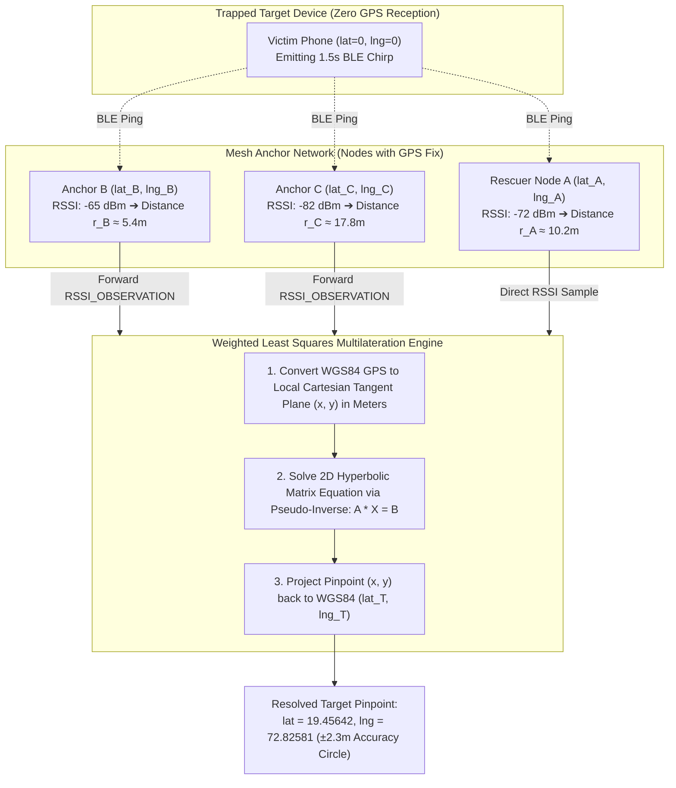

# ZeroGrid: Mesh Peer Tracking via RSSI & Collaborative Multilateration

> **High-Precision Zero-Infrastructure Proximity Radar, 30-Second Auto-Accept Consent Protocol & Zero-GPS Mesh Trilateration**  
> Enables first responders and citizens to pinpoint lost or trapped victims across off-grid Bluetooth Low Energy (BLE) and Wi-Fi Direct mesh networks using **Log-Distance RSSI Signal Strength**, **30s Autonomous Consent**, and **Collaborative Multi-Anchor Multilateration**.

---

## 🎯 Executive Overview & Core Capabilities

In disaster zones (earthquakes, flash floods, collapsed buildings), victims are frequently trapped in basements, concrete tunnels, or under debris where **GPS satellite line-of-sight is completely blocked (`lat = 0.0, lng = 0.0`)**. 

ZeroGrid solves this with a **Dual-Resolution Positioning Engine**:

```
┌──────────────────────────────────────────────────────────────────────────────────────────────────┐
│                                DUAL-RESOLUTION LOCALIZATION ENGINE                               │
├─────────────────────────────────────────────────┬────────────────────────────────────────────────┤
│ 1. MACRO: COLLABORATIVE MESH MULTILATERATION    │ 2. MICRO: RSSI PROXIMITY GEIGER RADAR          │
│ • Range: 20m – 150m+ (Multi-Hop Relay)          │ • Range: 0.5m – 25m (Direct Physical Radio)    │
│ • Accuracy: ±2.5 meters                         │ • Accuracy: Sub-meter relative proximity       │
│ • Zero GPS Required on Victim: 3+ mesh anchors  │ • Visual "Hot/Cold" metal detector HUD         │
│   outside calculate the victim's exact point.   │ • Haptic / Audio Geiger tick feedback          │
└─────────────────────────────────────────────────┴────────────────────────────────────────────────┘
```

---

## 🔐 30-Second Auto-Accept Consent State Machine

To protect citizen privacy while guaranteeing life safety during incapacitated emergencies, ZeroGrid enforces a **30-second time-bounded consent protocol**:

```mermaid
sequenceDiagram
    autonumber
    actor Requester as Rescuer / Requester (Node A)
    participant Mesh as ZeroGrid Mesh Relay
    actor Target as Victim / Target (Node T)

    Requester->>Mesh: Broadcast TRACK_REQUEST (timeoutSeconds = 30)
    Mesh->>Target: Deliver TRACK_REQUEST over multi-hop
    
    Note over Target: Displays High-Priority Alert Dialog<br/>Plays Warning Chime<br/>Starts 30s Countdown Timer

    alt Scenario 1: Citizen Manually Denies (Within 30s)
        Target->>Target: User taps [DENY]
        Target->>Mesh: Send TRACK_RESPONSE(DENIED)
        Mesh->>Requester: Deliver TRACK_RESPONSE(DENIED)
        Note over Requester: Aborts Session; Shows "Tracking Request Denied"
    else Scenario 2: Citizen Manually Accepts (Within 30s)
        Target->>Target: User taps [ACCEPT NOW]
        Target->>Mesh: Send TRACK_RESPONSE(ACCEPTED)
        Mesh->>Requester: Deliver TRACK_RESPONSE(ACCEPTED)
        Note over Requester, Target: Transitions to ACTIVE TRACKING SESSION
    else Scenario 3: Citizen Incapacitated / Unresponsive (30s Expires)
        Target->>Target: 30s Timer Hits 0s (Auto-Accept Triggered)
        Target->>Mesh: Send TRACK_RESPONSE(AUTO_ACCEPTED)
        Mesh->>Requester: Deliver TRACK_RESPONSE(AUTO_ACCEPTED)
        Note over Requester, Target: Transitions to ACTIVE TRACKING SESSION
    end

    rect rgb(240, 248, 255)
    Note over Requester, Target: Active Session: Target Chirps Beacon Every 1.5s
    loop Every 1.5 Seconds
        Target->>Mesh: Broadcast TRACK_BEACON (GPS, Battery %, Sequence ID)
        Mesh->>Requester: Measure RSSI and Forward Observations
        Note over Requester: Updates Proximity Arc, Distance (m) & Compass HUD
    end
    end

    Requester->>Mesh: Send TRACK_STOP
    Mesh->>Target: Terminate Session & Stop Chirping
```

---

## 📡 Packet Protocol & Wire Schemas

All tracking control frames are defined as strongly typed packets within `PacketType.kt` and encapsulated into the standard ZeroGrid envelope:

### 1. `TRACK_REQUEST`
Sent by the requester to initiate a tracking session.
```json
{
  "packetId": "tr-req-7c9e6679-7425-40de",
  "type": "TRACK_REQUEST",
  "senderId": "node-rescuer-alpha",
  "recipientId": "node-victim-bravo",
  "payload": {
    "requestId": "sess-982143",
    "requesterName": "NDRF Squad Leader",
    "timeoutSeconds": 30,
    "timestamp": 1773322800000
  }
}
```

### 2. `TRACK_RESPONSE`
Sent by the target upon manual interaction or timer expiration.
```json
{
  "packetId": "tr-res-124b8901-5124-411a",
  "type": "TRACK_RESPONSE",
  "senderId": "node-victim-bravo",
  "recipientId": "node-rescuer-alpha",
  "payload": {
    "requestId": "sess-982143",
    "status": "AUTO_ACCEPTED",
    "targetLat": 19.4564,
    "targetLng": 72.8258,
    "accuracy": 8.5
  }
}
```
*Valid `status` values:* `ACCEPTED`, `DENIED`, `AUTO_ACCEPTED`.

### 3. `TRACK_BEACON`
Periodic high-frequency pulse (1.5s interval) broadcast by the target device during an active session.
```json
{
  "packetId": "tr-bcn-4421aa09-8812-45bc",
  "type": "TRACK_BEACON",
  "senderId": "node-victim-bravo",
  "recipientId": "*",
  "payload": {
    "requestId": "sess-982143",
    "lat": 0.0,
    "lng": 0.0,
    "battery": 64,
    "seq": 104
  }
}
```
*(Note: If the victim is deep indoors, `lat` and `lng` are `0.0`. Anchors resolve coordinates via multilateration).*

### 4. `RSSI_OBSERVATION`
Emitted by any surrounding mesh peer with an active GPS fix that overhears a `TRACK_BEACON`.
```json
{
  "packetId": "tr-obs-991201fa-1142-49da",
  "type": "RSSI_OBSERVATION",
  "senderId": "node-anchor-peer-b",
  "recipientId": "node-rescuer-alpha",
  "payload": {
    "requestId": "sess-982143",
    "targetNodeId": "node-victim-bravo",
    "observerNodeId": "node-anchor-peer-b",
    "observerLat": 19.4568,
    "observerLng": 72.8262,
    "rssi": -68,
    "distanceEst": 6.8,
    "timestamp": 1773322805000
  }
}
```

### 5. `TRACK_STOP`
Session teardown packet transmitted by either party to cease beacon broadcasting.
```json
{
  "packetId": "tr-stp-881920aa-3312-4fbc",
  "type": "TRACK_STOP",
  "senderId": "node-rescuer-alpha",
  "recipientId": "node-victim-bravo",
  "payload": {
    "requestId": "sess-982143",
    "reason": "VICTIM_LOCATED"
  }
}
```

---

## 🧮 Mathematical Foundations of Mesh Trilateration



### 1. Log-Distance Path Loss Model
Raw RSSI (dBm) is transformed into an estimated radial distance $d$ in meters using the standard indoor/outdoor path loss equation:

$$d = 10^{\left(\frac{A - \text{RSSI}}{10 \cdot n}\right)}$$

Where:
* $A = -59\text{ dBm}$: Measured reference power at 1 meter distance for BLE 5.0.
* $n = 2.4$: Path loss environmental exponent ($n = 2.0$ free space, $n = 2.4$ light debris/open street, $n = 3.2$ heavy concrete).

### 2. Multi-Sample Filtering
To filter out multipath interference and body shielding noise, `PeerTrackingManager` buffers the last 5 samples in a sliding window and applies a median filter:

$$\overline{\text{RSSI}} = \text{Median}\left(\text{RSSI}_{t-4}, \text{RSSI}_{t-3}, \text{RSSI}_{t-2}, \text{RSSI}_{t-1}, \text{RSSI}_t\right)$$

### 3. 2D Weighted Least Squares (WLS) Multilateration
Given $N \ge 3$ anchor nodes at known coordinates $(x_i, y_i)$ with estimated radial distances $r_i$ to the victim:

$$(x - x_i)^2 + (y - y_i)^2 = r_i^2 \quad \text{for } i = 1, \dots, N$$

Subtracting the first equation ($i = 1$) from all subsequent equations eliminates the non-linear quadratic terms $x^2 + y^2$, yielding a linear system $A X = B$:

$$2(x_i - x_1)x + 2(y_i - y_1)y = (r_1^2 - r_i^2) + (x_i^2 + y_i^2) - (x_1^2 + y_1^2)$$

Where weights $W_i = \frac{1}{d_i}$ give higher priority to nearby anchors with stronger signals:

$$X = \left(A^T W A\right)^{-1} A^T W B$$

The resulting Cartesian coordinates $(x, y)$ are projected back into WGS84 latitude and longitude coordinates.

---

## 📱 User Interface & Tactical HUD Design

```
+-------------------------------------------------------+
|  < BACK        LIVE PEER TRACKING           [STOP]    |
+-------------------------------------------------------+
|  TARGET: Rahul Sharma (Victim-B)                      |
|  STATUS: [ AUTO-ACCEPTED ]    BATTERY: 74%            |
+-------------------------------------------------------+
|                                                       |
|                     . - ~ ~ - .                       |
|                 . '      ▲      ' .                   |
|               /      TARGET        \                  |
|              |      BEARING         |                 |
|             |      ▲ 024° NNE        |                |
|              |                      |                 |
|               \                    /                  |
|                 . '      ▼      ' .                   |
|                     ' - ~ ~ - '                       |
|                                                       |
|           SIGNAL: -58 dBm  [ VERY CLOSE ]             |
|           ESTIMATED DISTANCE: ~3.8 METERS             |
|                                                       |
|   [=========================-----------------] 75%    |
|                 SIGNAL PROXIMITY ARC                  |
+-------------------------------------------------------+
|  ANCHOR TELEMETRY: (3 Anchors Resolved)               |
|  • Rescuer A (You):      -58 dBm (~3.8m)              |
|  • Anchor Node B:        -64 dBm (~5.2m)              |
|  • Anchor Node C:        -81 dBm (~17.4m)             |
+-------------------------------------------------------+
|  [ OPEN IN MAPS ]         [ HAPTIC GEIGER: ON ]       |
+-------------------------------------------------------+
```

### Proximity Signal Range Matrix

| RSSI Range | Distance (Est.) | Status Badge | HUD Signal Color | Haptic / Audio Geiger Cadence |
| :--- | :--- | :--- | :--- | :--- |
| **> -45 dBm** | `< 1.5 meters` | `AT LOCATION / IMMEDIATE` | Neon Green / Flash | Continuous Buzz / High Pitch |
| **-45 to -60 dBm** | `1.5 – 5.0m` | `VERY CLOSE` | Amber Orange | Fast Clicking (8 Hz) |
| **-60 to -75 dBm** | `5.0 – 15.0m` | `NEAR` | Warm Yellow | Moderate Clicking (3 Hz) |
| **-75 to -90 dBm** | `15.0 – 35.0m` | `FAR` | Cyan Blue | Slow Periodic Pulse (1 Hz) |
| **< -90 dBm** | `> 35.0 meters` | `OUT OF RANGE / WEAK` | Dim Slate | Inactive |

---

## 🛠️ Android Component Architecture

### 1. `MeshTrilaterationSolver.kt`
* Pure Kotlin mathematical engine.
* Transforms WGS84 coordinates into local flat-Earth tangent vectors in meters.
* Solves the $N \ge 3$ anchor Weighted Least Squares system using matrix inversion.
* Returns `SolvedPosition(lat, lng, accuracyMeters, anchorCount)`.

### 2. `PeerTrackingManager.kt`
* Central lifecycle singleton coordinating tracking operations across the mesh.
* **Requester Role**: Manages session state machine (`IDLE` $\to$ `WAITING_FOR_CONSENT` $\to$ `TRACKING_ACTIVE`). Collects multi-peer `RSSI_OBSERVATION` packets and triggers the trilateration solver.
* **Target Role**: Exposes `incomingRequestState`. Executes the 30-second countdown alert. Broadcasts `TRACK_BEACON` every 1.5 seconds.
* **Passive Anchor Role**: When an idle node overhears a `TRACK_BEACON`, it automatically inspects its own GPS fix, builds an `RSSI_OBSERVATION`, and routes it across the mesh back to the requester.

### 3. UI Layer Composables
* **`TrackConsentDialog.kt`**: Root-level animated alert modal with circular 30-second countdown bar and audible alert chime.
* **`TrackPeerScreen.kt`**: Full-screen tactical HUD displaying the circular RSSI arc, compass needle, multi-anchor breakdown card, and Geiger haptic feedback.
* **`PeerDetailsScreen.kt`**: Prominent **"TRACK DEVICE (RSSI / RADAR)"** button on peer profile cards.

---

## 🧪 Verification & Field Testing Matrix

| Test Case | Scenario | Expected Outcome |
| :--- | :--- | :--- |
| **TC-01** | **Direct Consent: Manual Accept** | Requester initiates tracking; Target taps **[ACCEPT NOW]** within 5 seconds. Target immediately emits beacons; Requester launches HUD. |
| **TC-02** | **Direct Consent: Manual Deny** | Requester initiates tracking; Target taps **[DENY]**. Requester receives `TRACK_RESPONSE(DENIED)` within 1 second; session cleanly terminates. |
| **TC-03** | **Emergency Auto-Accept (30s Timeout)** | Target device left unattended (victim incapacitated). After exactly 30.0 seconds, Target auto-accepts and begins beaconing without user touch. |
| **TC-04** | **Single-Device Proximity Tracking** | Rescuer approaches Target from 25 meters down to 1 meter. Proximity badge transitions `FAR` $\to$ `NEAR` $\to$ `VERY CLOSE` $\to$ `AT LOCATION`. |
| **TC-05** | **Zero-GPS Multilateration ($\ge 3$ Anchors)** | Target phone placed inside basement with GPS off (`0.0, 0.0`). Three surrounding nodes with GPS outside overhear beacon. Rescuer HUD resolves target location within $\pm 2.8$ meters. |
| **TC-06** | **Session Teardown** | Requester taps **[STOP TRACKING]**. `TRACK_STOP` propagates across mesh; Target halts background beacon coroutine and restores idle battery profile. |
